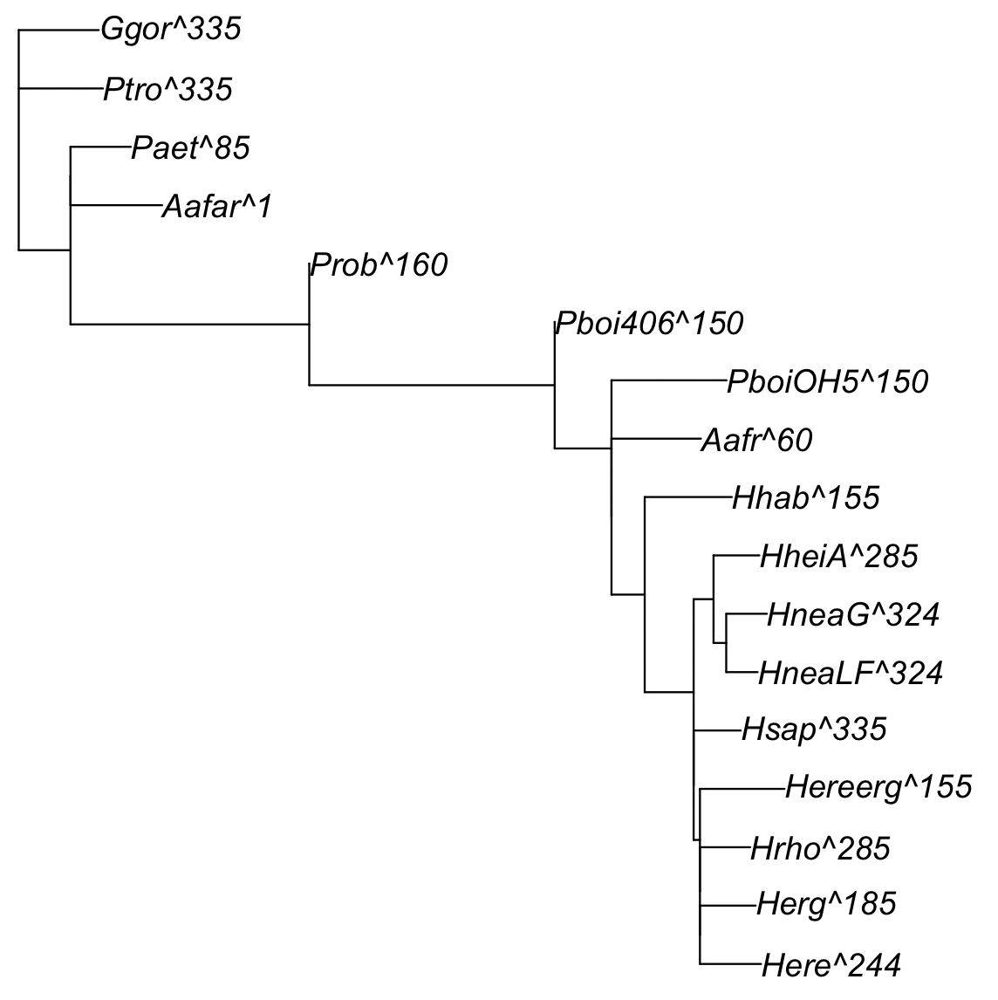

Continuous morphological characters (for example morhpometric landmarks) from extinct and extant species can help in Bayesian MCMC estimation of divergence times (Álvarez-Carretero et al. 2019). For datasets with a large number of characters and/or a large number of species, calculation of the character likelihood using Felsensteins's (1973) model can be computationally prohibitive and thus not suitable for MCMC sampling. However, general methods to approximate the likelihood are available that can speed up computation substantially (Thorne et al. 1998, dos Reis and Yang, 2011).

In this tutorial you will learn how to use the approximation for fast MCMC sampling of divergence times using an example of landmarks for hominid species. This tutorial assumes you are familiar with (1) phylogenetic inference and morphometrics, (2) the MCMCtree program for divergence time estimation, (3) R programming, and (4) working with the command line (or terminal) from your operating system. Before you start this tutorial you must have [PAML](http://abacus.gene.ucl.ac.uk/software/paml.html) installed in your system, [R](https://www.r-project.org/) (or RStudio), and the following R packages: [mcmc3r](https://github.com/dosreislab/mcmc3r), [morphoml](https://github.com/dosreislab/morphoml), and their dependencies. This tutorial was prepared and tested on a MacOS system. It should also run in Linux and Windows, perhaps with some modifications.

# Tutorial
To approximate the likelihood, we first find the maximum likelihood estimates  of the branch lengths (bMLEs) on the phylogeny. The branch lengths may be given in units of morphological evolution (for morphological data) or substitutions per site (for molecular data). Then we calculate the gradient, g, (the vector of first derivaties) and the Hessian, H, (the matrix of second derivaties) of the likelihood function with respect to the branch lengths, evaluated at the MLEs. Then the bMLEs, g and H are passed to the MCMC sampler, and Taylor's equation (e.g. dos Reis and Yang, 2019: p. 313) is used to approximate the likelihood during the sampling. The general procedure of this tutorial is as follows:

1. Select and prepare the data to be analysed.
2. Estimate the bMLEs, g, and H for every data partition.
3. Perform MCMC sampling of divergence times and rates.
4. Calculate summary statistics and check for convergence.
5. Reconstruct ancestral continuous character states (in required).

## 1. The Data: Alignment and Phylogeny

You can find the data required for this tutorial within the `data/hominids/` directory in the `morhpoml` R package distribution (see GitHub link above). Create a `gHtutorial/` directory in a suitable place in your system, and copy all the files into this new directory. All the files are in text format and you can use your favorite text editor (e.g. Notepad or TexEdit) to examine them. The files are:

* `morpho-matrix-procrustinized.phy`: Procrusted-aligned landmarks from 4 extant and 17 extinct hominid species from González-José et al. (2008). Landmarks were measured across four cranial modules, each with 7, 11, 14 and 21 landmarks. The first module has 2D landmarks, and the rest have 3D landmarks. This gives a total of 2 * 7 + 3 * (11 + 14 + 21) = 152 characters.

* `mitdna-4s.phy`: an alignment of mitochondrial genomes for the 4 extant species. The alignment is compressed into site patterns (analysis of this file is leaved as an excercise at the end of the tutorial).

* `dummy.phy`: A fake dummy alignment required for approximate sampling.

* `17s-rooted.tree`: the rooted phylogeny (without branch lengths) for the 17 species.

* `mcmctree-*.ctl`: control files required by MCMCtree to carry out the analysis.

## 2. Estimation of bMLEs, g and H

_Unrooting the tree_. – Calculation of the bMLEs, g, and H is carried with the `morphoml` R package for the morphological data, and with MCMCtree and BASEML for the molecular data. Because the evolutionary models we will be using are reversible, these calculations must be done using unrooted trees. Thus, our first step will be to use MCMCtree to unroot the tree. When doing MCMC sampling, MCMC switches between the rooted tree (to sample the branch lengths) and the unrooted tree (to calculate the likelihood). Please do not use other software than MCMCtree to unroot the tree, as the resulting unrooted representation may be incompatible with the representation used by MCMCtree, and the resulting MCMC sample may corrupted.

Open file `mcmctree-unroot.ctl`, which tells MCMCtree to unroot the tree. The file looks like this:

```
      seqfile = dummy.phys
     treefile = 17s-rooted.tree

       usedata = 3  * 0:sample from prior; 
                    * 1:exact sampling; 
                    * 2:approx sampling (in.BV); 
                    * 3: unroot tree and generate out.BV

       ndata = 1 
```

The first line tells MCMCtree to use the dummy alignment. In the second line we provide the rooted tree. Then we set `usedata = 3` which tells MCMCtree to unroot the tree and generate control files for bMLE, g and H estimation for molecular data. Finally, `ndata = 1` means to only use the first partition in the data file. In the command line type:

```
mcmctree mcmctree-unroot.ctl
```

This command will work only if MCMCtree is correctly installed in your system, and in your system's PATH variable (see [PAML's website](http://abacus.gene.ucl.ac.uk/software/paml.html) for details). If successful, the program will generate a series of `tmp*` files, as well as other files. File `tmp001.trees` contains the rooted tree. The other files can be ignored. Rename `tmp001.trees` as `17s-unrooted.tree` and delete the other `tmp*` files, and any other newly generated files. In a Mac terminal you can do:

```
mv tmp0001.trees 17s-unrooted.tree
rm tmp* rst* rub out* lnf 2base.t
```

_Generating the morph.BV file_. – We will use `morphoml` to generate the `moprh.BV` file, containing the bMLEs, g and H for the morphological data. Open an R terminal (or RStudio) and ensure the working directory is the one into which you copied all the data files. In my system, I put my files in `~/phyl/morpho/hominid/gHtutorial/`, in your system, it will be a different directory. First, we read the morphological alignment and phylogeny into R:

```r
# set the working directory as appropriate:
setwd("~/phyl/morpho/hominid/gHtutorial/")

# read continuous trait matrix:
# we skip the first line as this line contains the number of taxa and 
# number of characters
hM <- read.table("morpho-matrix-procrustinized.phy", skip=2)

# convert ot a matrix and set taxa names as matrix row names:
taxa <- hM[,1]
hM <- as.matrix(hM[,-1])
rownames(hM) <- taxa

# read tree unrooted topology:
utree <- ape::read.tree("17s-unrooted.tree")
plot(utree)
```

We now use the estimate the MLEs, g, and H

```r
opt.hM <- morphoml::optim_blen_vcv(hM, utree, model="ind")
opt.hM$convergence
# [1] 1
# Did not converge, so re-optimise:
opt.hM <- morphoml::optim_blen_vcv(hM, utree, model="ind",
          initblen = opt.hM$brlens)
opt.hM$convergence
# [0]
```

Command `opt.hM$convergence` is used to check if the branch length optimisation converged. In my case, it returned 1 the first time, which means it did not converge (0 means convergence). So I the  branch length estimates as starting values in a second optimisation round, which then converged. Note results may vary depending on system, so you may need to do more rounds (or none) of optimisation if necessary.

We can plot the tree with optimised branch lengths for checking.

```r
plot(opt.hM$tree)
```


The branch lengths represent the amount of morphological evolution along lineaegs. Chimp (Ptro) and Gorilla (Ggor) are morhpologically similar and are close in the tree. The stem branch towards _Homo_ then expands, indicating large accummulated morphological variance among landmarks, with the _Homo_ speciments then clustered together.

The numbers next to species names are their ages, which are in the forward time convention (used by MCMCtree). The oldest specimen is _Australopithecus afarencis_ which has age 1. The youngest speciments are Chimp, Gorilla, and modern Human, which have age 335. To calculate the traditional backward ages, we simply substract the largest age (335) from all ages and multiply by minus 1. So _A. afarensis_ age is -(1 - 335) = 334, or 3.34 Million years old.

```r
forward.ages <- as.numeric(unlist(strsplit(utree$tip.label, "^",
                fixed=TRUE))[seq(from=2, to=34, by=2)])
backward.ages <- -(forward.ages - max(forward.ages)) / 100
data.frame(utree$tip.label, forward.ages, backward.ages)
```

We now write the bMLE, g, and H to an in.BV file. This file is needed by MCMCtree for MCMC sampling with the approximate method.

```r
morphoml::write.in.BV(file="in.BV", opt.hM)
```

## 3. MCMC sampling

## 4. Summary statistics and convergence diagnostics

## 5. Ancestral trait reconstruction

## Co-analysis of morphological and molecular data (Excercise)

The general procedure to co-anlayse the morphological and molecular data in a single analysis is as follows. First, because ...

## References
Álvarez-Carretero et al. (2019) Bayesian estimation of species divergence times using correlated quantitative characters. Syst. Biol., 68: 967–986.

dos Reis and Yang (2011) Approximate likelihood calculation on a phylogeny for Bayesian estimation of divergence times. Mol. Biol. Evol., 28: 2161–2172.

dos Reis and Yang (2019) Bayesian molecular clock dating using genome-Scale datasets. in Anisimova (ed.) Evolutionary Genomics: Statistical and Computational Methods, Methods in Molecular Biology, 190: 309–330.

Felsenstein (1973) Maximum-likelihood estimation of evolutionary trees from continuous characters. Am. J. Hum. Genet., 25: 471–492.

González-José et al. (2008) Cladistic analysis of continuous modularized traits provides phylogenetic signals in _Homo_ evolution. Nature, 453: 775–778.

Thorne et al (1998) Estimating the rate of evolution of the rate of molecular evolution. Mol. Biol. Evol., 15: 1647–1657.
